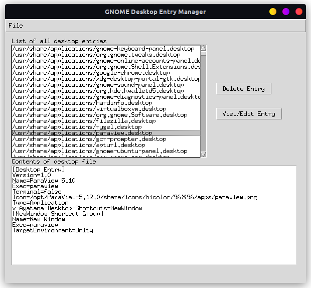
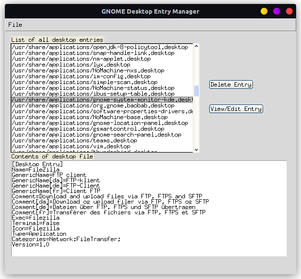
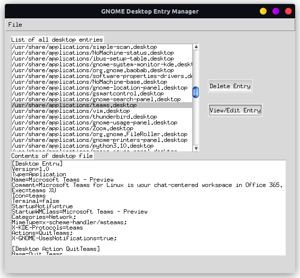

# GNOME-Desktop-Entry
A Desktop Entry editor for GNOME.

## The setup
GTK is too complicated to even setup. So, I will use tkinter.


## Themes

For Luna style legacy themes use ttkthemes. [Here](https://ttkthemes.readthedocs.io/en/latest/themes.html#) is a list of all themes. 
```
pip install ttkthemes
```

For modern dark and light themes use [customtinker](https://github.com/TomSchimansky/CustomTkinter).

```sh
pip install customtkinter
```
# Snips
## Legacy theme


## Win XP theme


## OS X theme
